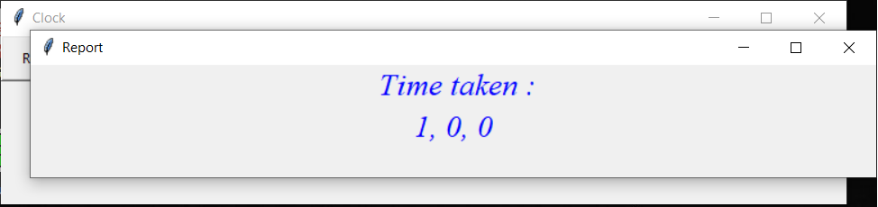

# progress_tracking_clock
This is a simple clock that opens with small window. Every time you complete a question, just mark done.

It'll show, your progress with percentage and progress bar. It'll also show time in format : " mm, ss "  You'll get the option to see report that shows, how long you took to solve questions (in minutes), ordered in order of questions.

This simple clock is idea generated from the video of William Lin : https://youtu.be/dZ_6MS14Mg4

NOTE : When you'll run this program, a text file named : 'Clock file' with 'there !' text in it, will be generated in D-drive. You can rename "there !" to your name to personlize it.

First UI :

Add Number of questions you want to do. Along with timit limit in hours and minutes. This Hi there can be renamed to your name e.g. : Hi Shanu

Second UI : (After pressing Start)

Click Done after you complete a question and Click Finish to Stop to clock counter.

Third UI : (After pressing Finish)

Click Resume to resume the contest/practice, Click Reset to reset the clock, Click Report to get the report of your progress i.e., telling how many minutes you took to complete questions.

Fourth UI : (After pressing Report)

Sample report.
